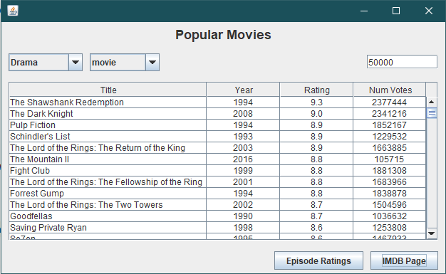

<h1 align="center"> IMDB Movie Rating Database Table</h1>

  <a href="#-technologies">Technologies</a>&nbsp;&nbsp;&nbsp;|&nbsp;&nbsp;&nbsp;
  <a href="#-project">Project</a>&nbsp;&nbsp;&nbsp;|&nbsp;&nbsp;&nbsp;
  <a href="#-layout">Layout</a>&nbsp;&nbsp;&nbsp;|&nbsp;&nbsp;&nbsp;

 

  

## 🚀 Technologies

- Java
- PostgreSQL

## 💻 Project

The project is a software to search movies from IMDB database lists.

## 🔖 Layout

The program layout features a simple and organized interface.

---
